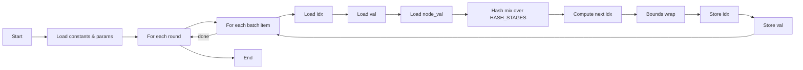

# Diagrams

## Machine Components

```mermaid
flowchart TB
  subgraph Core[Core]
    direction TB
    SCR[Scratch RAM]\nsize=SCRATCH_SIZE
    PC[Program Counter]
    ST[State]
  end

  subgraph Engines[Engines per Core]
    ALU[alu x SLOT_LIMITS.alu]
    VALU[valu x SLOT_LIMITS.valu]
    LD[load x SLOT_LIMITS.load]
    STOR[store x SLOT_LIMITS.store]
    FLOW[flow x SLOT_LIMITS.flow]
  end

  Program[Program: list[Instruction]]
  Mem[Memory Image]

  Program -->|bundle per cycle| Engines
  Engines -->|read/write| SCR
  Engines -->|read/write| Mem
  Core --> Engines
```

## Kernel Control Flow (Baseline)



