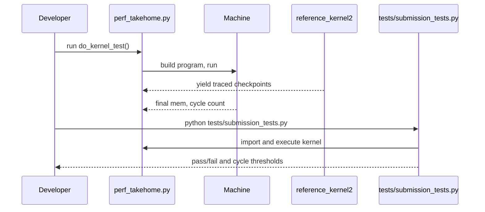

# Architecture Overview

This project simulates and optimizes a kernel on a custom VLIW + SIMD machine. The starter kernel is intentionally unoptimized and correctness is validated against a frozen reference implementation and tests.

## Modules

- `problem.py` — Simulator and reference logic
  - Machine/cores, instruction engines (`alu`, `valu`, `load`, `store`, `flow`), tracing, and reference kernels (`reference_kernel`, `reference_kernel2`).
  - Defines ISA-ish slot ops and limits: `SLOT_LIMITS`, `VLEN`, `N_CORES`, `SCRATCH_SIZE`.
- `perf_takehome.py` — Optimization entrypoint
  - `KernelBuilder` builds a program (list of instruction bundles) using scalar ops only as baseline.
  - `do_kernel_test` runs the simulator against the traced reference to check correctness and print cycles.
- `tests/` — Submission harness and checks
  - `submission_tests.py` drives correctness and cycle thresholds. Do not modify per upstream guidance.
- `watch_trace.py`, `watch_trace.html` — Perfetto trace viewer utility for interactive debugging.

## Data Flow

## Execution Model

- VLIW: Each instruction bundle may contain multiple engine slots, executed in parallel up to `SLOT_LIMITS` per engine per cycle; effects are applied end-of-cycle.
- SIMD: `valu`, `vload`, `vstore`, `vbroadcast`, `vselect` operate on vectors of `VLEN` contiguous lanes.
- Scratch: Integer scratch space acts as registers and temporary storage; constants are hoisted into scratch via `load const`.

## Kernel Baseline

- Scalar-only baseline loops over rounds and batch items, performing:
  1) gather index/value, 2) gather node, 3) hash mixing via `HASH_STAGES`, 4) compute next index, wrap, 5) write back index/value.
- Current `build` packs one slot per bundle; no VLIW packing or vectorization. This keeps correctness simple but wastes parallelism and cycles.

## Tracing & Debugging

- `Machine.setup_trace()` emits Chrome Trace Event JSON (`trace.json`) with per-engine/lane tracks for visualization in Perfetto.
- `debug compare` slots validate intermediate states against `reference_kernel2` when tracing.

## Test & Submission Pipeline

## Key Constraints & Risks

- Do not change `tests/` when validating submissions.
- Multicore is intentionally disabled (`N_CORES = 1`).
- Out-of-scratch risks: `SCRATCH_SIZE` is enforced; vector temporaries need careful planning.
- Correctness must match reference memory at checkpoints when enabled.

