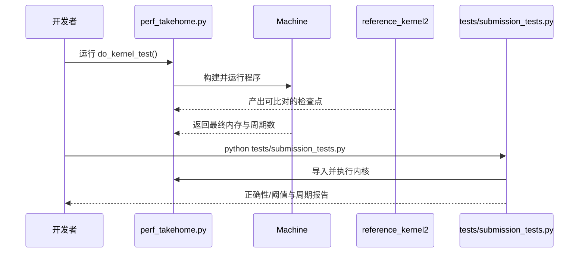

# 架构总览（中文）

本项目模拟一个自定义的 VLIW + SIMD 机器，并在其上优化一个内核（kernel）。当前起始内核为标注用的“标量基线实现”，用于正确性校验与性能基准。

## 模块划分
- `problem.py` — 模拟器与参考实现
  - 机器/核心、指令引擎（`alu`, `valu`, `load`, `store`, `flow`）、追踪（trace）、参考内核（`reference_kernel`, `reference_kernel2`）。
  - 定义 ISA 风格的槽位与限制：`SLOT_LIMITS`、`VLEN`、`N_CORES`、`SCRATCH_SIZE`。
- `perf_takehome.py` — 优化入口
  - `KernelBuilder` 构建指令程序（指令包列表），当前基线仅使用标量指令且不进行 VLIW 打包。
  - `do_kernel_test` 驱动模拟器与参考实现比对，输出周期（cycles）。
- `tests/` — 提交校验与阈值测试（不要修改）
- `watch_trace.py`, `watch_trace.html` — 基于 Perfetto 的可视化追踪工具

## 数据流

## 执行模型
- VLIW：每个指令包可并行包含多个引擎槽位，受 `SLOT_LIMITS` 限制；写入在周期末统一生效。
- SIMD：`valu`、`vload`、`vstore`、`vbroadcast`、`vselect` 等向量化指令按 `VLEN` 宽度处理连续元素。
- Scratch：充当寄存器/常量/手动缓存，通过 `load const` 将常量驻留于 scratch。

## 内核基线
- 以标量方式按轮次与批内元素遍历：取 `idx`/`val` → 取 `node_val` → 按 `HASH_STAGES` 混合哈希 → 计算下一层索引并包围（wrap）→ 回写 `idx`/`val`。
- 构建器 `build` 仅“一槽一包”，未利用 VLIW 并行与 SIMD，存在大量性能空间。

## 追踪与调试
- `Machine.setup_trace()` 生成 Chrome Trace Event JSON（`trace.json`），用 Perfetto 可视化。
- `debug compare` 槽在追踪时校验中间态与 `reference_kernel2` 的一致性。

## 提交/测试流程

