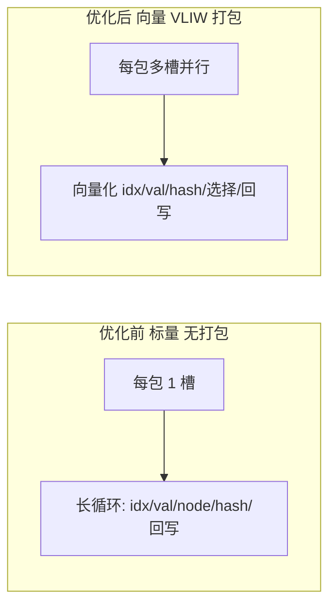
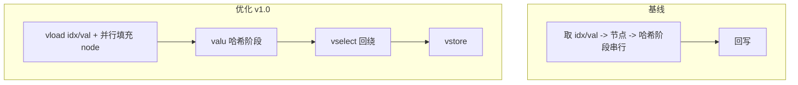

# 优化方案 v1.0  （中文）

目标：在保持 `tests/submission_tests.py` 正确性的前提下，大幅降低周期（baseline 约 147,734 cycles），优先利用 VLIW 并行与 SIMD。

## 优先级

- VLIW 打包：同一周期内填满各引擎可用槽位，减少指令包数量。（预期收益：降低包数与周期数，提升吞吐）
- 向量化内层循环：按 `VLEN`（=8）批处理连续元素，使用 `vload/vstore/valu/vbroadcast/vselect`。（预期收益：减少迭代次数与指令数量）
- 地址生成优化：基址外提，`flow.add_imm` 增量推进；减少重复加法与取模。（预期收益：降低 ALU 压力与地址计算成本）
- 分支消除：用 `vselect` 实现 `+1/+2` 选择与越界回绕判断，避免控制流分岔。（预期收益：减少分支开销，提高稳定吞吐）
- 调试最小化：性能测试时关闭或减少 `debug` 槽以免污染周期。（预期收益：释放槽位与比较开销，降低周期噪声）

## 实施草图

- 扩展 `KernelBuilder.build` 为按引擎贪心打包（不超过 `SLOT_LIMITS`），同包内避免 WAR/WAW 冲突。
- 引入向量 scratch：`idx_v`, `val_v`, `node_v`, `pred_v`（长度 = VLEN）。
- 外层按轮次，内层每次处理 `VLEN` 个批元素（尾部不足走标量回退）。
- `values/indices` 可 `vload/vstore`；`node_v` 为非连续 gather，初版用并行标量 `load` 填充。
- 将 `HASH_STAGES` 中的常量 `vbroadcast` 至向量寄存区，使用 `valu` 完成逐阶段混合。

## 优化前后对比图

### 1. 计算结构对比（标量 vs 向量 + VLIW）

### 2. 槽位占用对比（示意）

```mermaid
gantt
  title 单周期槽位利用率（示意）
  dateFormat  X
  axisFormat  %L
  section 优化前
  alu_1_of_12    :a1, 0, 1
  load_1_of_2    :a2, 0, 1
  store_1_of_2   :a3, 0, 1
  flow_1_of_1    :a4, 0, 1
  section 优化后
  alu_6_of_12    :b1, 0, 1
  load_2_of_2    :b2, 0, 1
  store_2_of_2   :b3, 0, 1
  flow_1_of_1    :b4, 0, 1
```

（注：示意图仅表达“更高并行度/占用率”，非精确时序。）

### 3. 数据路径对比（关键路径缩短）

## 校验

- 与 `reference_kernel2` 的 `pause/yield` 保持必要的同步点，或在性能测试时关闭 `debug` 对比。
- 正确性以 `tests/submission_tests.py` 为准，不修改 `tests/`。

## 风险/缓解

- scratch 压力：优先复用向量暂存，必要时回落标量路径。
- `node_val` 非连续 gather：初版用并行标量 `load` 覆盖 `VLEN` 个元素，后续再探索重排与缓存策略。

## 下一步

- 实现贪心 VLIW 打包器（按引擎计数，对冲突做简单避让）。
- 增加向量化路径与尾部标量回退。
- 新增性能开关（禁用 `debug`），并用 `tests/submission_tests.py` 验证周期收益。
