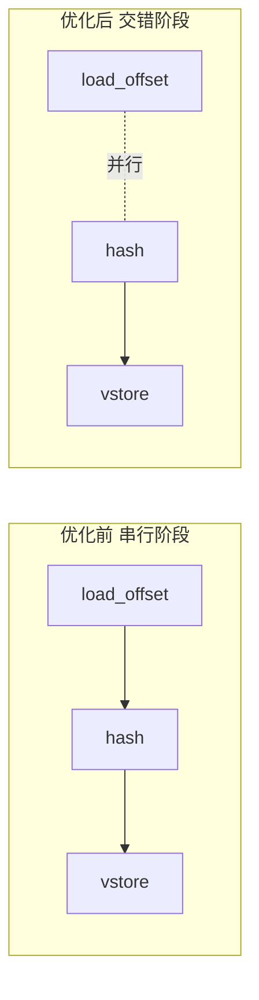
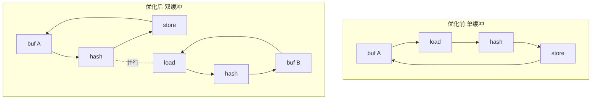
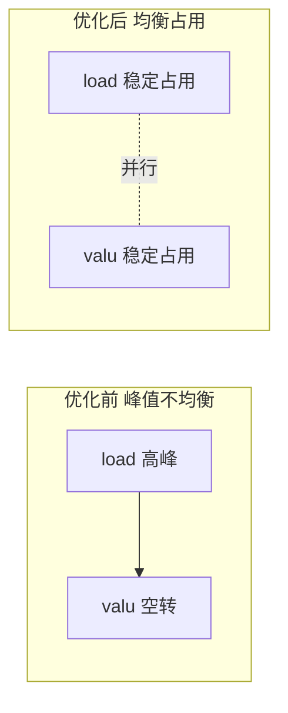

# 优化方案 v0.4（中文）

目标：在保持 `tests/submission_tests.py` 正确性的前提下，继续压缩 cycles2，目标趋近 1200（如可行）。当前 trace 约 12846 cycles2。

## 基线现状
- 主路径已向量化 + VLIW 打包，瓶颈集中在 load_offset 的高频 gather 与 hash 链路。
- load engine 峰值占用偏高，valu 有空转窗口。

## Trace 摘要
- load engine 峰值 3/2，存在超限拥塞；util 约 20.17%。
- valu util 约 17.30%，峰值 6/6，但仍有空转窗口。
- 热点操作：`load_offset` 4096 次，`+` 6144 次，`^` 3072 次，`<<` 2048 次，`>>` 1024 次。

## 优先级（含预期收益）
- 深度软件流水 + 双缓冲：将 `load_offset` 分散进 hash 多阶段之间，使 load/valu 交错并行。（预期收益：预计降低 1200 到 2200 cycles2）
- Hash 链路重排：将与下一阶段无依赖的 `valu` 操作前置，提高单包利用率。（预期收益：预计降低 500 到 900 cycles2）
- 尾部标量压缩：减少尾部标量路径的临时地址与算术指令。（预期收益：预计降低 200 到 500 cycles2）

## 实施草图
1) **深度软件流水 + 双缓冲**
   - 维持 `buf A / buf B` 两套向量寄存器。
   - Hash 阶段中穿插发射 `load_offset`，形成交错执行。
   - 目标是把 load 峰值摊平成持续占用，减少停顿。

2) **Hash 链路重排**
   - 分析 `HASH_STAGES` 依赖链，重排可并行的 `valu` 操作。
   - 让每包更接近 `SLOT_LIMITS.valu` 上限。

3) **尾部标量压缩**
   - 合并标量路径中重复的地址计算与回写序列。
   - 保持严格依赖，避免读写错误。

## 优化前后对比图

### 1. 架构对比（阶段交错 vs 串行）

### 2. 双缓冲对比（寄存器视角）

### 3. 引擎占用对比（load 与 valu 并行化）

## 校验
- `python tests/submission_tests.py` 必须通过。
- trace 需证明 load 峰值下降、valu 空转减少。

## 风险与缓解
- 调度重排可能引入依赖冲突：保持保守依赖模型，逐步验证。
- 更激进流水可能增加寄存器压力：优先复用与短生命周期变量。

## 待审核
- 本版本为计划草案，等待人工审核后进入实现与测量阶段。
