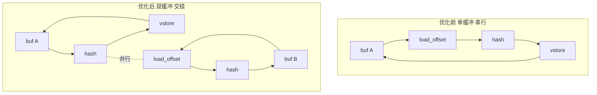
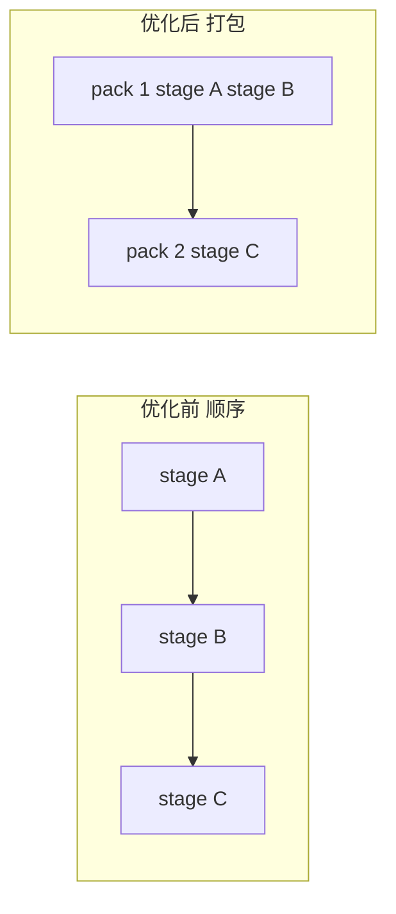
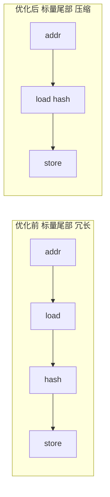

# 优化方案 v0.4（中文）

## 目标
- 在保持 `tests/submission_tests.py` 正确性的前提下，继续压缩 cycles2。
- 目标趋近 1200（如可行）。当前 trace 约 12846 cycles2。

## 基线情况
- 主路径已向量化并使用 VLIW 打包。
- load_offset 高密度 gather 带来 load 拥塞。
- hash 链路占用 valu 但仍存在空转窗口。

## 摘要
- 本轮聚焦于 load 与 valu 的并行化交错。
- 通过双缓冲与流水重排减少 load 峰值拥塞。
- 预期合计降低约 2000 cycles2。

## 核心瓶颈
- load engine 峰值 3/2，存在超限拥塞，util 约 20.17%。
- valu util 约 17.30%，峰值 6/6 但仍有空转窗口。
- 热点操作：`load_offset` 4096 次，`+` 6144 次，`^` 3072 次，`<<` 2048 次，`>>` 1024 次。

## 本次优化要解决的问题
- 让 load_offset 与 hash 交错并行，减少 load 峰值。
- 提升 valu 连续占用率，减少空转窗口。
- 压缩尾部标量路径的冗余指令。

## 优化点

### 1) 深度软件流水与双缓冲
- 优先级：🌟🌟🌟
- 核心思想：在 hash 阶段之间插入下一批次的 load_offset，通过双缓冲交错执行。
- 步骤：
  1. 维持 buf A 与 buf B 两套向量寄存器。
  2. 批次 N hash 时，批次 N+1 发射 load_offset。
  3. 控制调度顺序，避免 load 峰值超过 2 槽。
- 改进前后图表：

- 预期收益：预计降低 1200 到 2200 cycles2
- 预期收益：预计降低 1200 cycles2

### 2) Hash 链路重排
- 优先级：🌟🌟
- 核心思想：重排可并行的 valu 操作，提高单包利用率。
- 步骤：
  1. 分析 HASH_STAGES 的依赖链。
  2. 将可并行阶段前置，减少等待。
  3. 让每包更接近 valu 槽上限。
- 改进前后图表：

- 预期收益：预计降低 500 cycles2

### 3) 尾部标量压缩
- 优先级：🌟
- 核心思想：压缩尾部标量路径的地址计算与回写链路。
- 步骤：
  1. 合并重复地址计算。
  2. 缩短临时寄存器使用路径。
  3. 保持依赖顺序不变。
- 改进前后图表：

- 预期收益：预计降低 300 cycles2

## 校验
- `python tests/submission_tests.py` 必须通过。
- trace 需证明 load 峰值下降与 valu 空转减少。

## 风险与缓解
- 调度重排可能引入依赖冲突：保持保守依赖模型，逐步验证。
- 更激进流水可能增加寄存器压力：优先复用与短生命周期变量。

## 待审核
- 本版本为计划草案，等待人工审核后进入实现与测量阶段。
