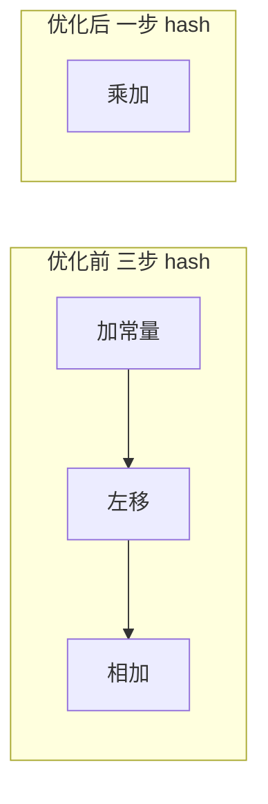
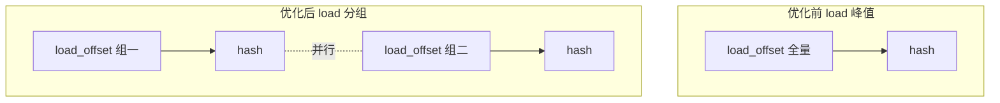
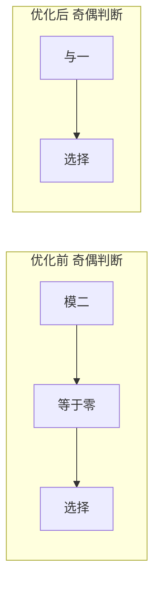

# 优化方案 v0.5（中文）

## 目标
- 在保持 `tests/submission_tests.py` 正确性的前提下，继续压缩 cycles2。
- 目标趋近 1200。当前基线约 10862 cycles2。

## 基线情况
- v0.4 已实现深度流水与双缓冲，load 与 valu 并行度提升。
- 仍存在 load 峰值 3/2 的拥塞，hash 链路 op 密集。

## 摘要
- 本轮聚焦于 hash 链路的算子融合与 load 压力再平衡。
- 预计合计降低约 2000 cycles2。

## 核心瓶颈
- load engine 峰值 3/2，仍有超限拥塞。
- valu util 约 20.46%，峰值 6/6，但存在空转窗口。
- 热点操作：`load_offset` 4096 次，`+` 6144 次，`^` 3072 次，`<<` 2048 次，`>>` 1024 次。

## 本次优化要解决的问题
- 降低 hash 链路的 valu 指令数量。
- 将 load 高峰进一步摊平到稳定占用。
- 压缩奇偶判断与回绕相关的标量与向量指令。

## 优化点

### 1) Hash 算子融合到 multiply_add
- 优先级：🌟🌟🌟
- 核心思想：对满足结构的 hash 阶段，将 `加常量` 与 `左移相加` 融合为一次 multiply_add。
- 步骤：
  1. 识别结构为 `a 加常量 再与 a 左移相加` 的阶段。
  2. 替换为 `a 乘常量 再加常量` 的单条指令。
  3. 维持模 2^32 行为一致。
- 改进前后图表：

- 预期收益：预计降低 1200 cycles2

### 2) load_offset 分组交错调度
- 优先级：🌟🌟
- 核心思想：按 lane 分组发射 load_offset，将 load 峰值保持在 2 槽以内。
- 步骤：
  1. 将 VLEN lane 切分为两组或四组。
  2. 在 hash 阶段之间插入分组 load_offset。
  3. 调整包内顺序，避免同周期 load 超限。
- 改进前后图表：

- 预期收益：预计降低 500 cycles2

### 3) 奇偶判断与回绕压缩
- 优先级：🌟
- 核心思想：用位运算替代取模并合并比较，减少两条以上指令。
- 步骤：
  1. 使用 `与一` 代替 `模二`。
  2. 直接用结果参与 vselect。
  3. 保持回绕逻辑不变。
- 改进前后图表：

- 预期收益：预计降低 300 cycles2

## 校验
- `python tests/submission_tests.py` 必须通过。
- trace 需证明 load 峰值下降与 valu 空转减少。

## 风险与缓解
- 算子融合可能引入等价性风险：用参考输出逐轮对比。
- load 分组可能拉长关键路径：严格控制分组大小并保持依赖顺序。
- 位运算替换需确认无符号溢出一致：保持模 2^32 语义。

## 待审核
- 本版本为计划草案，等待人工审核后进入实现与测量阶段。
