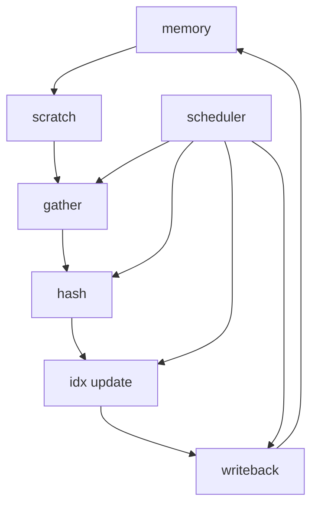
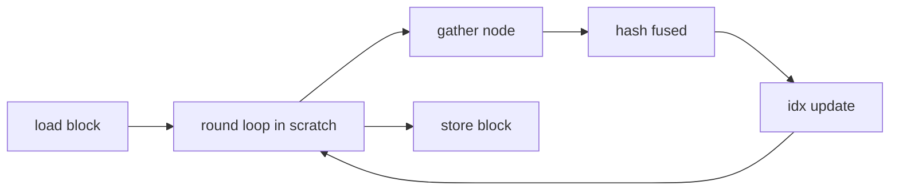
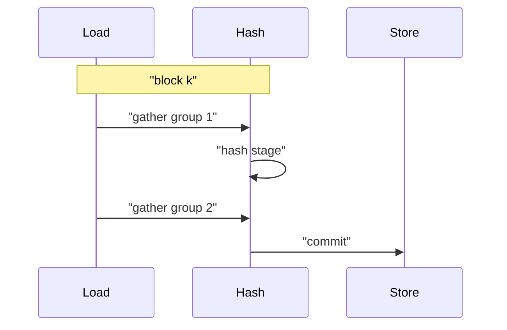
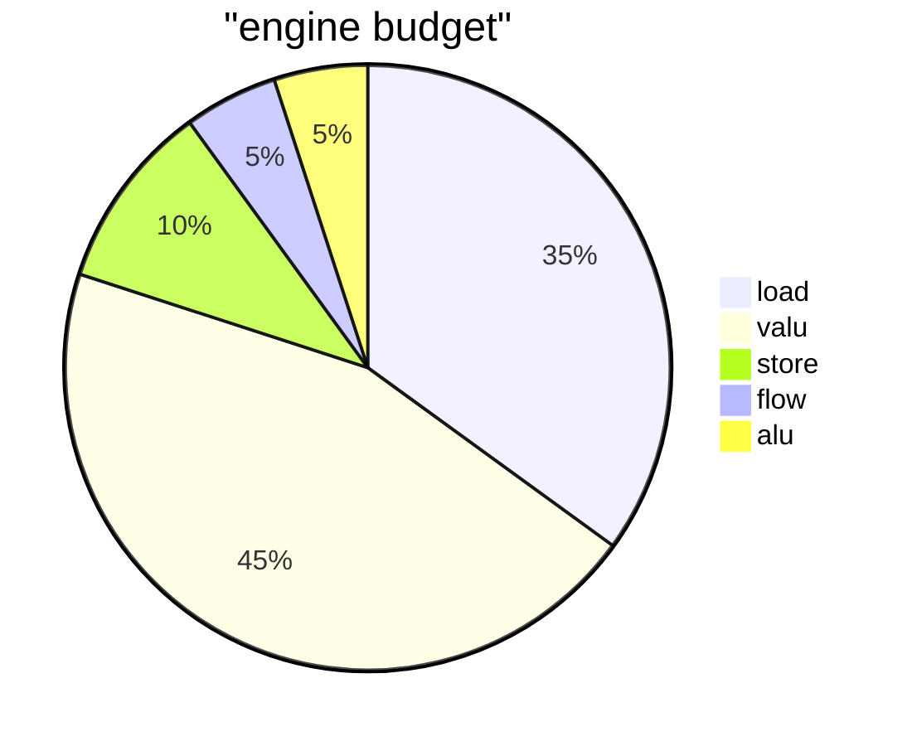
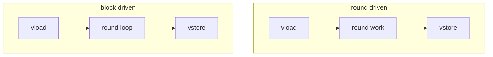
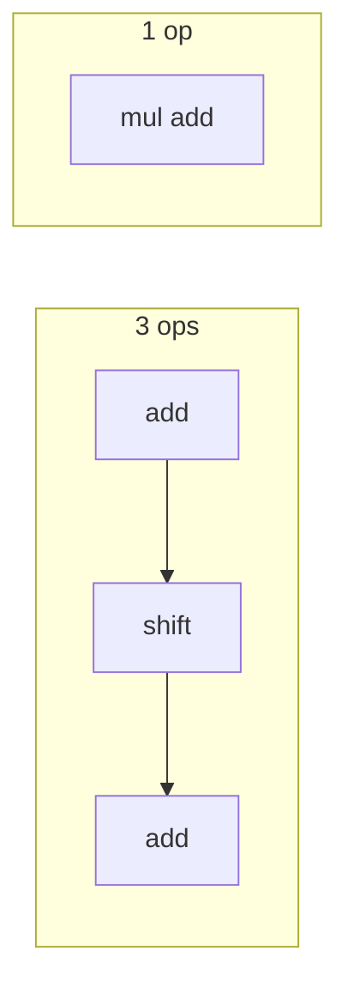
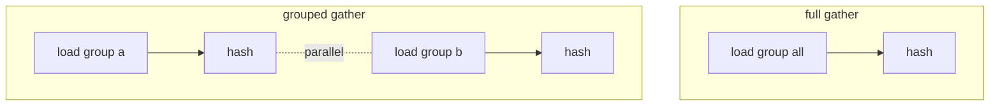

# 优化方案 v0.6（中文）

## 第一性原理与资源约束
- SIMD 向量宽度 VLEN=8。
- 引擎上限：valu 6 槽，load 2 槽，store 2 槽，flow 1 槽。
- Scratch 1536，可容纳多套向量缓冲与中间态。
- 每轮必须读取 node 值，hash 与 idx 更新依赖上一轮结果。

## 理论下界与数学推导
设 B=VLEN=8，R=rounds=16，Sload=2，Svalu=6。

- 每轮 gather 至少需要 B 次 load_offset  
  Cload >= ceil(B / Sload) = ceil(8/2) = 4 cycles

- 每轮 hash 链路操作数近似  
  Nh = 1 xor + 6 stages * 3 ops + 6 for idx 更新与回绕  
  Nh ~= 25  
  Cvalu >= ceil(Nh / Svalu) = ceil(25/6) = 5 cycles

因此单轮理论下界约为  
Cround >= max(Cload, Cvalu) = 5 cycles

若将 3 个可融合阶段从 3 ops 化简为 1 op，  
Nh' ~= 19 => Cvalu' >= ceil(19/6) = 4 cycles  
则 Cround' ~= 4 cycles

内存往返下界  
现状：每轮 vload + vstore  
全轮：4 * R 次向量内存操作  
若轮次内存驻留，则变为 4 次向量内存操作  
比例约为 R 倍下降

## 1.0 系统架构蓝图
核心思想：以批次块为单位驻留状态，轮次内自循环，减少内存往返；同时用算子融合降低 valu 指令密度；再以分组 gather 调度平衡 load 峰值。

### 系统架构图


### 流程图


### 时序图


### 数据流程图


### 资源占用饼图


## 本次优化要解决的问题
- 轮次间不必要的内存往返。
- hash 链路 valu 指令密度过高。
- load 峰值高于上限导致拥塞。

## 优化点

### 1) 轮次内存驻留与循环交换
- 优先级：🌟🌟🌟🌟🌟
- 核心思想：批次块驻留 scratch，完成全部 rounds 后再写回。
- 步骤：
  1. 以 VLEN 或 2*VLEN 为块 vload idx 与 val。
  2. 在 scratch 中循环执行 rounds。
  3. 结束后一次性 vstore。
- 改进前后图表：


### 2) Hash 算子融合到 multiply_add
- 优先级：🌟🌟🌟🌟
- 核心思想：将加常量与左移相加的三步链路压缩为一次乘加。
- 步骤：
  1. 识别 op2 为加法且 op3 为左移的阶段。
  2. 预计算乘数常量并 vbroadcast。
  3. 用 multiply_add 代替三条 valu 指令。
- 改进前后图表：


### 3) 分组 gather 调度
- 优先级：🌟🌟🌟
- 核心思想：将 VLEN lane 分组交错，避免单周期 load 超限。
- 步骤：
  1. 将 lane 分两组或四组。
  2. 组间插入 hash 阶段。
  3. 以包级调度限制 load 峰值。
- 改进前后图表：


## 代码草案
```python
for block in blocks:
    vload idx, val
    for r in range(rounds):
        gather node in groups
        val = hash_fused(val ^ node)
        idx = next_idx(val, idx)
    vstore idx, val
```

## 校验
- `python tests/submission_tests.py` 必须通过。
- 通过 trace 验证内存往返减少与 load 峰值下降。

## 风险与缓解
- 循环交换必须保持语义一致，确保每轮依赖正确。
- 算子融合需保持模 2^32 行为一致。
- 分组 gather 可能增加控制复杂度，先保守分组。

## 待审核
- 本版本为计划草案，等待人工审核后进入实现与测量阶段。
