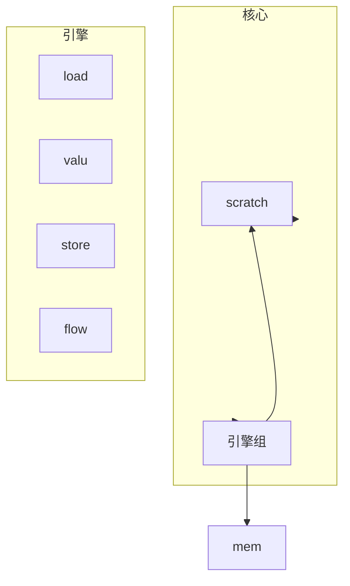
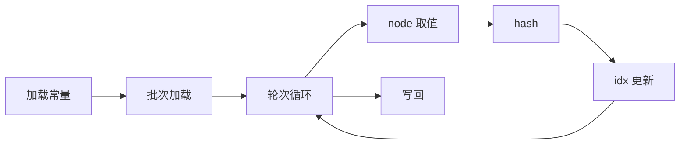
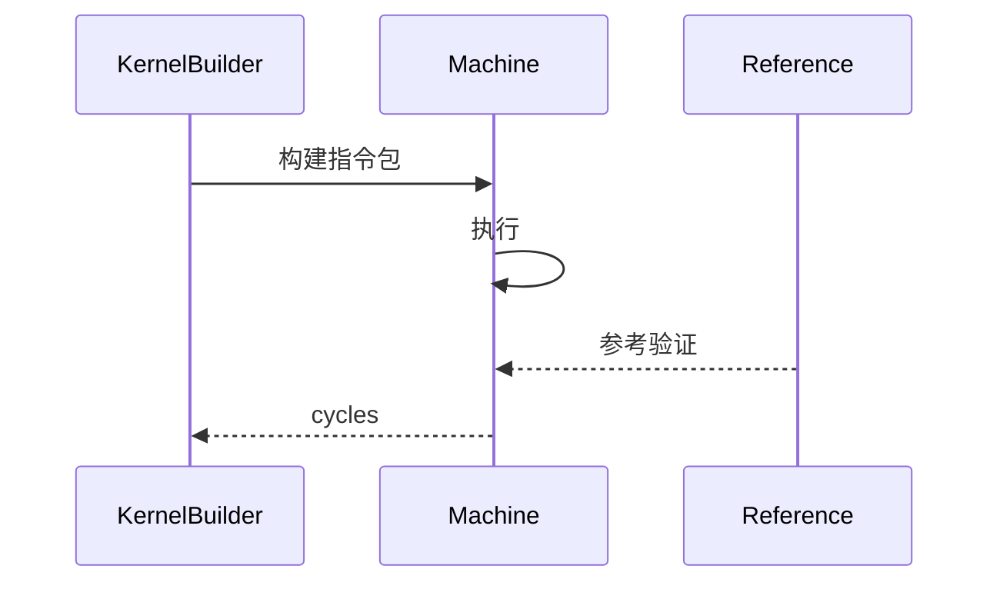
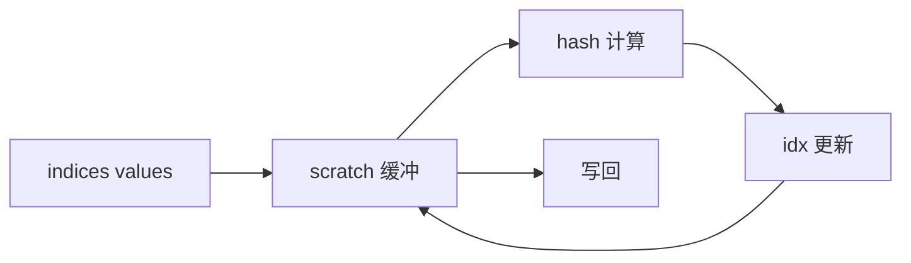
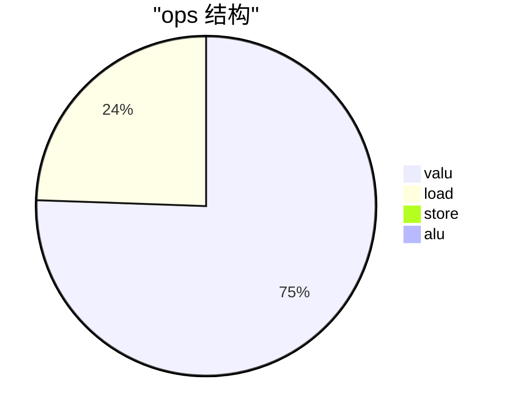
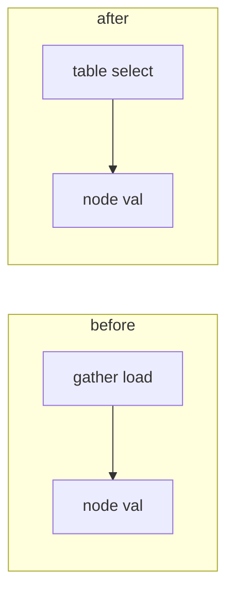
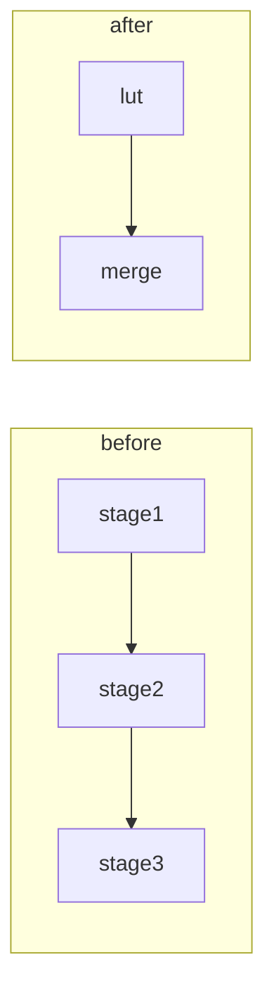
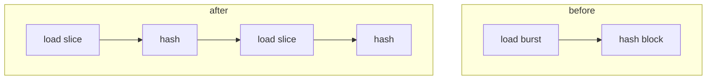

# 优化方案 v0.7（中文）

## 目标
- 在保持 `tests/submission_tests.py` 正确性的前提下，继续压缩 cycles2。
- 目标趋近 1200。当前基线约 2525 cycles2。

## 第一性原理与资源约束
- 机器模型：VLIW + SIMD，单核，单周期最多执行 `load x2` 与 `valu x6`，每条指令包写回在周期末生效。
- 数据访问：树节点访问为不连续 gather，主要通过 `load_offset` 实现。
- 资源上限：`load` 与 `valu` 同时成为瓶颈，任何优化必须同时降低两者的峰值依赖。
- 正确性约束：与 `reference_kernel2` 完全一致，不可修改 `tests/`。

## 理论下界与数学推导
记 `L` 为 load 操作数，`V` 为 valu 操作数，`S` 为 store 操作数，周期下界为：
```
cycles >= max(ceil(L/2), ceil(V/6), ceil(S/2))
```
当前 trace 粗略统计：
- `L ≈ 3165`，`V ≈ 9780`，`S ≈ 64`
- 下界约为 `max(1583, 1630, 32) = 1630`

为达到 1200，需要同时满足：
- `L <= 2400`
- `V <= 7200`

因此目标是：
1) 通过深度特化减少 gather 轮次，使 `L` 降至 2000-2300；
2) 通过哈希压缩将 `V` 降至 7000-7200；
3) 通过调度把利用率推近上限，减少空转。

## 核心瓶颈
- `load_offset` 仍是最大 load 热点，占用 12 个轮次。
- hash 链路占用 6 个阶段，valu 操作数仍高。
- 一些轮次内仍存在 load 与 valu 的阶段性空档。

## 本次优化要解决的问题
- 消灭深度 2 和深度 3 的 gather 负载。
- 将 hash 阶段改写为更少的 valu 操作。
- 把 load 插入更均匀地穿插在 hash 计算之间。

## 系统架构图


## 流程图


## 时序图


## 数据流程图


## 饼图


## 优化点

### 1) 深度 2 和深度 3 节点表特化
- 优先级：🌟🌟🌟
- 核心思想：深度 2 与深度 3 的节点索引范围固定，提前加载 4 或 8 个节点值到 scratch，通过位选择组合出 node_val，避免 `load_offset`。
- 步骤：
  1. 启动时加载深度 2 的 4 个节点与深度 3 的 8 个节点。
  2. 计算 `offset = idx - base` 与 `bit0 bit1 bit2`。
  3. 用乘加链路构造选择树，生成 node_val。
  4. 这些轮次禁用 gather。
- 改进前后图表：

- 预期收益：`load_offset` 减少约 1024，cycles 下界下降约 500。

### 2) Hash 分段查表压缩
- 优先级：🌟🌟
- 核心思想：将 hash 链路拆成两个段，以 8 位或 12 位 LUT 近似执行多阶段变换，减少每轮 valu 指令数。
- 步骤：
  1. 生成小型 LUT，覆盖多阶段合成变换。
  2. 把 val 拆成高低段，分别查表。
  3. 以少量 VALU 合并段结果，保持 32 位一致性。
  4. 评估 LUT 成本与 load 容量平衡。
- 改进前后图表：

- 预期收益：valu 下降 20 到 30 百分比，目标下界接近 1200。

### 3) 负载分配与分组调度再平衡
- 优先级：🌟
- 核心思想：把下一组的 gather 负载分散到 hash 内部的多个时隙，保证 load 峰值稳定在 2。
- 步骤：
  1. 为 group 设定固定插入点。
  2. 在 hash 与 idx 之间穿插 `load_offset`。
  3. 保持先算后用的依赖。
- 改进前后图表：

- 预期收益：减少空转周期，提升 load 与 valu 利用率到 75 以上。

## 代码草案
```python
# depth2 table select sketch
base = 3
offset = idx - base
bit0 = offset & 1
bit1 = (offset >> 1) & 1
t0 = v0 + bit0 * (v1 - v0)
t1 = v2 + bit0 * (v3 - v2)
node = t0 + bit1 * (t1 - t0)

# hash LUT sketch
hi = (val >> 16) & 0xFFFF
lo = val & 0xFFFF
val = lut_hi[hi] ^ lut_lo[lo]
```

## 校验
- `python tests/submission_tests.py` 必须通过。
- trace 中 `load_offset` 总数明显下降，`valu` 总数下降到 7000 左右。

## 风险与缓解
- LUT 可能引入精度偏差：逐轮 trace 比对确保一致。
- 深度选择逻辑增加 valu 操作：与 load 减少做权衡，必要时分阶段上线。
- scratch 压力上升：优先复用 temp 并分批加载表项。

