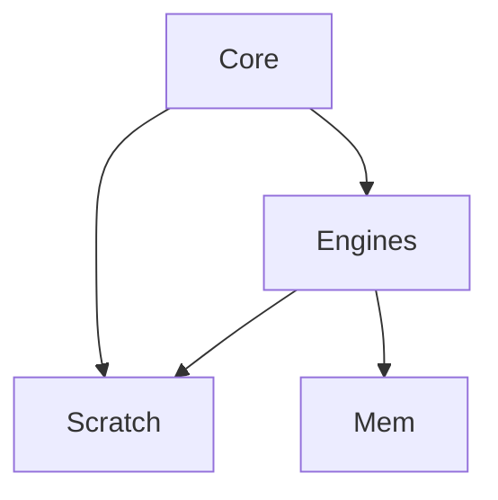
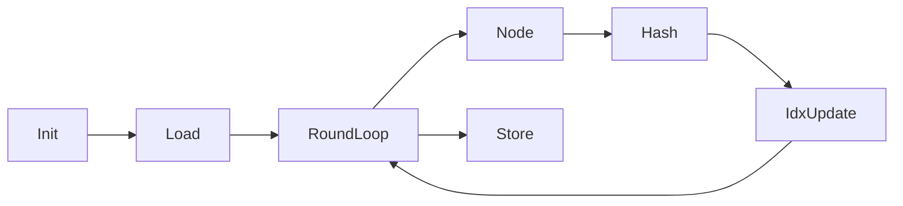
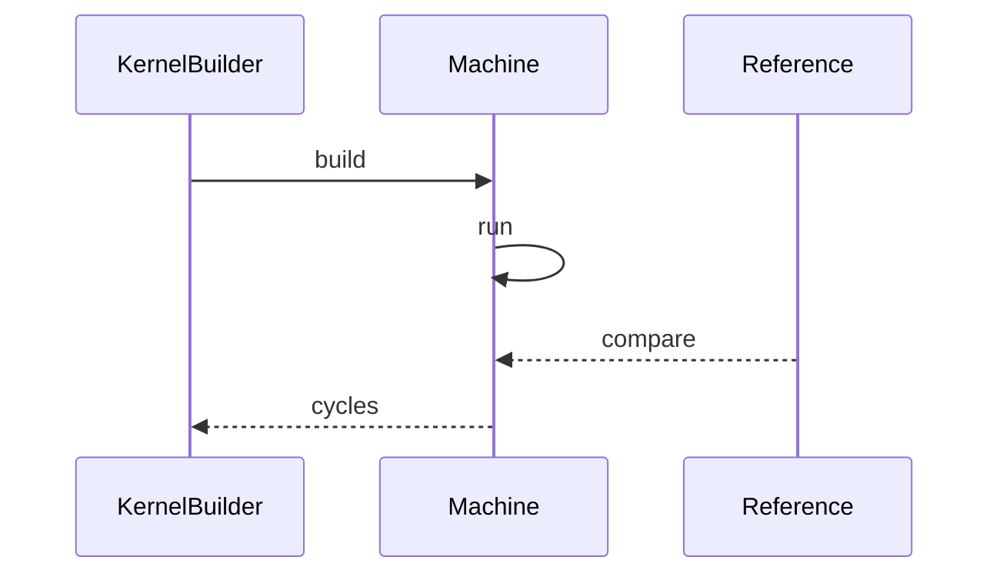
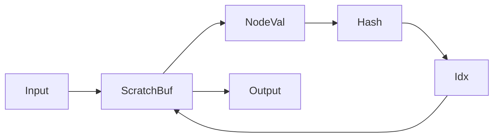
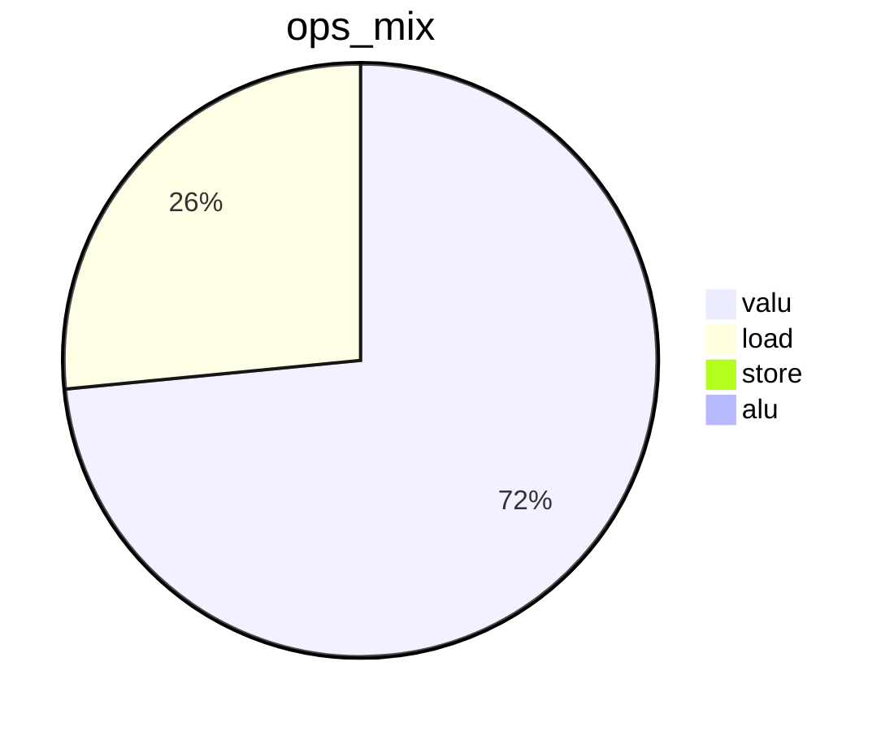
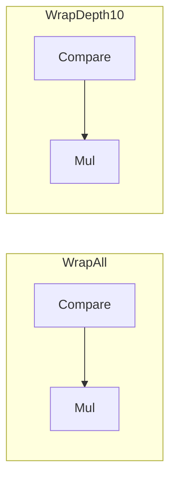
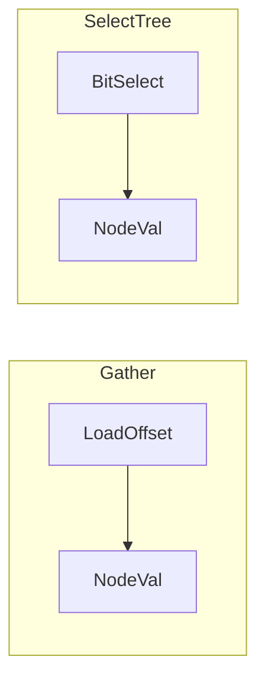
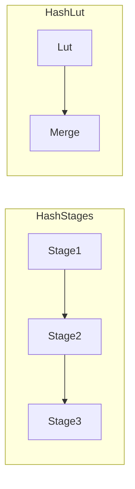

# 优化方案 v0.8（中文）

## 目标
- 在保持 `tests/submission_tests.py` 正确性的前提下，继续压缩 cycles2。
- 目标趋近 1200。当前基线约 2423 cycles2。

## 第一性原理与资源约束
- 指令并行：每周期最多 `load x2`、`valu x6`，写回在周期末生效。
- 吞吐上限：最终周期受 `max(L/2, V/6)` 约束，调度只能逼近下界，不能突破。
- 访问约束：树节点访问为随机 gather，无法通过 vload 实现全连续读取。
- 正确性约束：输出必须与 `reference_kernel2` 一致，`tests/` 不可修改。

## 理论下界与数学推导
令 `L` 为 load 操作数，`V` 为 valu 操作数，`S` 为 store 操作数：
```
cycles >= max(ceil(L/2), ceil(V/6), ceil(S/2))
```
当前 trace：
- `L ≈ 3165`，`V ≈ 8756`，`S ≈ 64`
- 下界约 `max(1583, 1459, 32) = 1583`

要达到 1200，需要同时满足：
- `L <= 2400`
- `V <= 7200`

因此本轮策略是：减少无效 wrap 运算，收缩 V 的“固定成本”，为后续深度特化和 hash 压缩腾出预算。

## 核心瓶颈
- `load_offset` 仍是主要 load 热点。
- idx wrap 在非最深轮次仍执行，造成不必要的 valu 消耗。
- hash 链路占用固定 6 阶段，valu 操作数仍高。

## 本次优化要解决的问题
- 移除非最深轮次的 wrap 比较与乘法。
- 在 root 轮次简化 idx 更新路径。
- 建立 1200 cycles 路线图的数学约束与下一步落点。

## 系统架构图


## 流程图


## 时序图


## 数据流程图


## 饼图


## 优化点

### 1) 深度感知的 wrap 消除
- 优先级：🌟🌟🌟
- 核心思想：只有 depth 等于 forest_height 时才可能越界，其他轮次无需 wrap。
- 步骤：
  1. 计算 `depth = round_i % (forest_height + 1)`。
  2. 当 `depth != forest_height` 时跳过 `< n_nodes` 与 `*`。
  3. depth 为 0 的轮次直接用 `idx = parity + 1`。
- 改进前后图表：

- 预期收益：valu 减少约 1024 ops，cycles 从 2525 降至 2423。

### 2) 深度 2 与 3 预加载选择树
- 优先级：🌟🌟
- 核心思想：提前加载 depth2 的 4 节点与 depth3 的 8 节点，使用位选择代替 gather。
- 步骤：
  1. 启动时加载 depth2 和 depth3 节点到 scratch。
  2. 计算 `bit0 bit1 bit2`，用乘加构造选择树。
  3. 在对应轮次禁用 gather。
- 改进前后图表：

- 预期收益：`load_offset` 下降约 1024，L 下界降至 ~1070 cycles。

### 3) Hash 压缩与分段 LUT
- 优先级：🌟
- 核心思想：将 hash 拆分为两段查表与少量合并运算，减少每轮 valu 操作数。
- 步骤：
  1. 设计 12-bit LUT 段，减少 3 个 hash stage。
  2. 通过 XOR 与 add 合并段结果，保持 32-bit 一致性。
  3. 测量 LUT 带来的 load 与 valu 权衡。
- 改进前后图表：

- 预期收益：valu 下降 20 到 30 百分比，目标下界接近 1200。

## 代码草案
```python
# depth 0 idx update
parity = val & 1
idx = parity + 1

# depth10 wrap
if depth == forest_height:
    idx = idx if idx < n_nodes else 0

# depth2 select sketch
bit0 = offset & 1
bit1 = (offset >> 1) & 1
t0 = v0 + bit0 * d01
t1 = v2 + bit0 * d23
node = t0 + bit1 * (t1 - t0)
```

## 校验
- `python tests/submission_tests.py` 必须通过。
- trace 中 `valu` 总量下降到 8756 左右，`load_offset` 维持或下降。

## 风险与缓解
- 深度特化若错误会破坏路径：使用 debug compare 验证每轮中间态。
- LUT 可能引入等价性风险：用参考输出逐轮对比。
- scratch 压力上升：用分层加载与复用 temp 降低压力。

