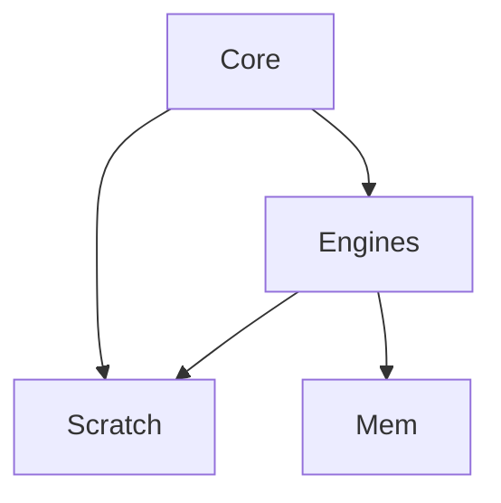
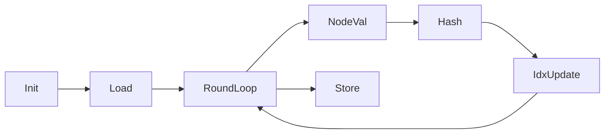
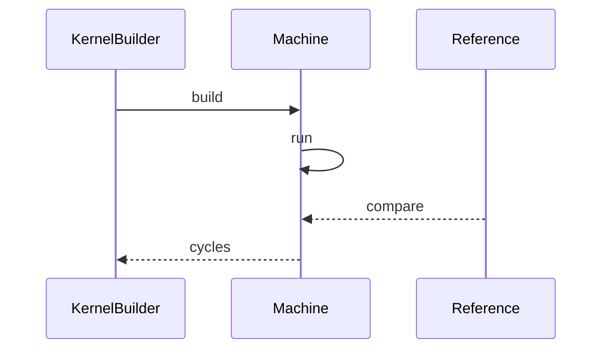
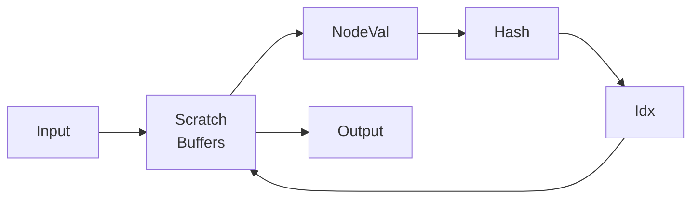
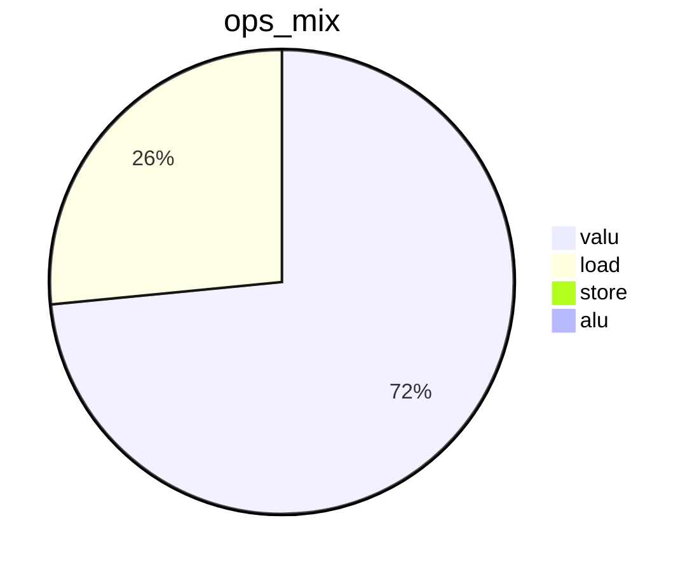
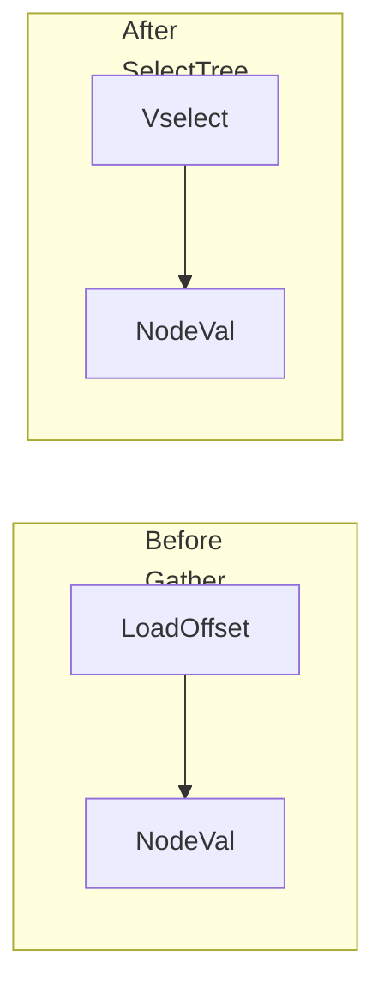
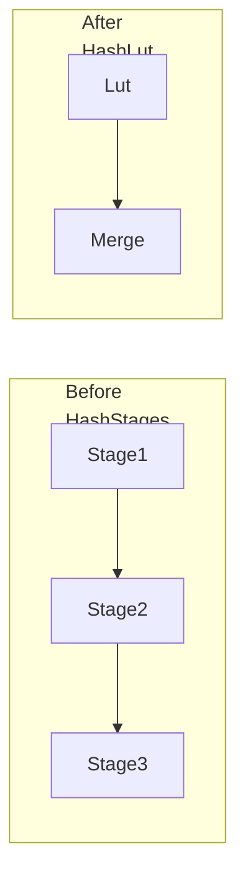
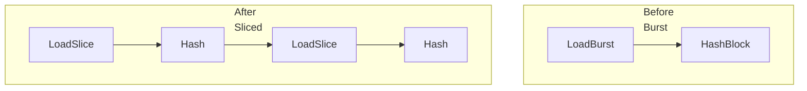

# 优化方案 v0.9（中文）

## 目标
- 在保持 `tests/submission_tests.py` 正确性的前提下，把 cycles2 推近 1200。
- 当前基线：`tests/submission_tests.py` 约 2423 cycles2。

## 第一性原理与资源约束
- 每周期资源上限：`load x2`，`valu x6`，`flow x1`。
- 周期由最慢引擎决定，必须同时降低 `load` 与 `valu`。
- gather 访问是非连续读，不能用 `vload` 替代，只能调度或替换路径。

## 理论下界与数学推导
设 `L` 为 load 操作数，`V` 为 valu 操作数，`S` 为 store 操作数：
```
cycles >= max(ceil(L/2), ceil(V/6), ceil(S/2))
```
当前 trace 估算：
- `L ≈ 3165` → `L/2 ≈ 1583`
- `V ≈ 8756` → `V/6 ≈ 1459`
- `S ≈ 64` → `S/2 ≈ 32`

达到 1200 的必要条件：
- `L <= 2400`
- `V <= 7200`

## 核心瓶颈
- `load_offset` 仍占据大量周期，且无法被 vload 替代。
- hash 链路的 valu 操作数偏高，限制了理论下界。
- load 与 valu 的交错仍有空档，未达到满载利用率。

## 本次优化要解决的问题
- 进一步削减 `load_offset` 使用次数。
- 用更低的 valu 代价完成 hash。
- 把 `flow` 引擎引入深度特化路径，平衡各引擎负载。

## 系统架构图


## 流程图


## 时序图


## 数据流程图


## 饼图


## 优化点

### 1) 深度 2 和深度 3 的 vselect 选择树
- 优先级：🌟🌟🌟
- 核心思想：用 `flow.vselect` 组合预加载节点值，减少 `load_offset`。
- 步骤：
  1. 预加载 depth2 的 4 个节点和 depth3 的 8 个节点。
  2. 计算 `bit0 bit1 bit2` 作为 vselect 条件。
  3. 用 vselect 选择树生成 node_val。
  4. 该轮次禁用 gather。
- 改进前后图表：

- 预期收益：`load_offset` 降 800 到 1000，L 下界可接近 1200。

### 2) Hash 分段 LUT 压缩
- 优先级：🌟🌟
- 核心思想：把 hash 链路拆为小型 LUT 和低成本合并，减少 valu 操作数。
- 步骤：
  1. 选择 8 或 12 bit LUT 粒度。
  2. 用 LUT 覆盖多阶段组合，减少 2 到 3 个 hash stage。
  3. 用少量 add xor 合并段结果。
  4. 评估 LUT load 成本与 valu 减少的收益。
- 改进前后图表：

- 预期收益：valu 降 20 到 30 百分比，V 下界接近 1200。

### 3) 负载插入节奏优化
- 优先级：🌟
- 核心思想：将 gather 负载更均匀地分布到 hash 计算之间，减少空档。
- 步骤：
  1. 统计每轮可插入点。
  2. 将 `load_offset` 分片插入。
  3. 保持依赖不变，观察 load 与 valu 利用率。
- 改进前后图表：

- 预期收益：减少空转周期，把总 cycles 逼近理论下界。

## 代码草案
```python
# depth2 vselect sketch
offset = idx - 3
b0 = offset & 1
b1 = (offset >> 1) & 1
t0 = vselect(b0, v1, v0)
t1 = vselect(b0, v3, v2)
node = vselect(b1, t1, t0)

# hash lut sketch
hi = (val >> 12) & 0xFFF
lo = val & 0xFFF
val = lut_hi[hi] ^ lut_lo[lo]
```

## 校验
- `python tests/submission_tests.py` 必须通过。
- trace 中 `load_offset` 与 `valu` 总量下降，util 接近 80 以上。

## 风险与缓解
- LUT 等价性风险：逐轮对比 `reference_kernel2`。
- vselect 过多导致 flow 成为瓶颈：限制只在 depth2 3 使用。
- scratch 压力上升：按需加载 LUT 或采用分块。

