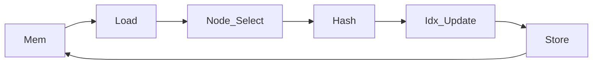
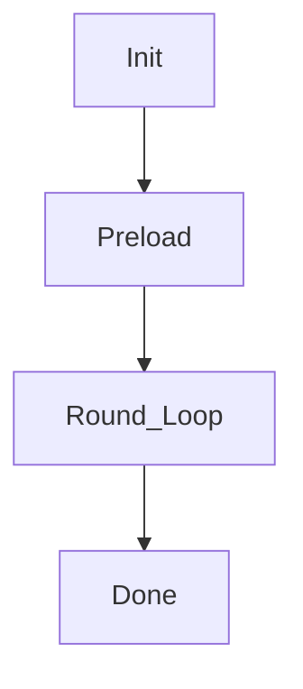
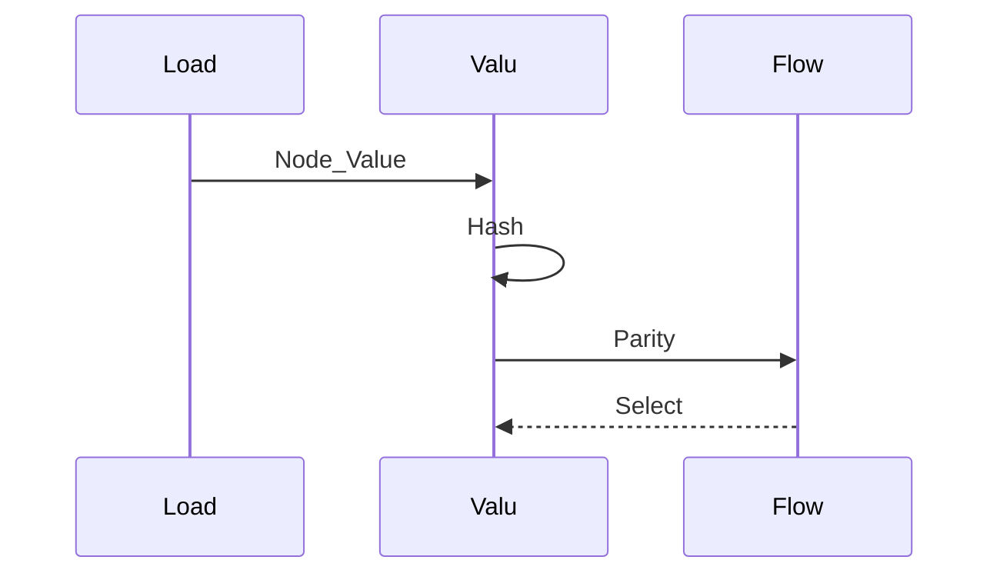
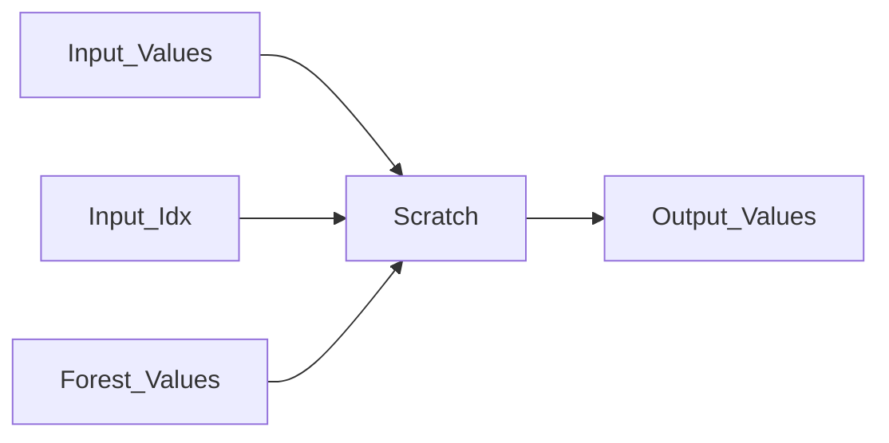
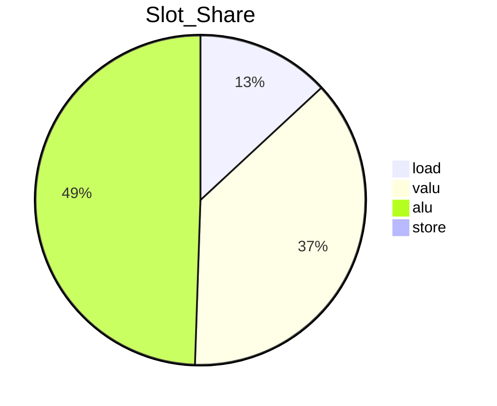
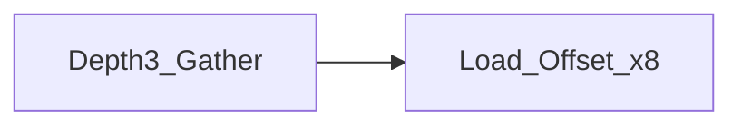
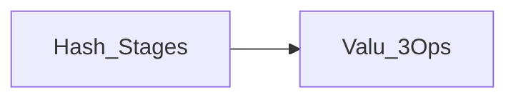

# 优化方案 v2.0（中文）

## 目标
- 目标：cycles ≤ 1200
- 当前基线：~1678 cycles（本地测得，`rounds=16, batch=256`）

## 第一性原理与资源约束
- 引擎并行度：`load=2, valu=6, alu=12, store=2, flow=1`
- 向量宽度：`VLEN=8`
- Scratch 上限：`SCRATCH_SIZE=1536`
- Memory 访问限制：无 vector gather，只有标量 `load_offset`
- 关键结论：仅靠调度无法突破理论下界，必须削减 `load` 与 `valu` 总量

## 理论下界与数学推导
下界公式：
```
cycles >= max(ceil(L/2), ceil(V/6), ceil(S/2))
```
当前统计（v2.0 预备态）：
- `L ≈ 2658`
- `V ≈ 7611`
- `S = 32`

下界：
```
max(1329, 1269, 16) = 1329
```
要达到 1200，需满足：
- `L <= 2400`
- `V <= 7200`

## 核心瓶颈
- `valu` slot 数量过高（哈希链路 + 深度选择）
- `load_offset` 仍为主压力（深度 3 之后的大量 gather）
- 调度效率不足（实际 cycles 明显高于理论下界）

## 本次优化要解决的问题
1) 降低 `load_offset` 数量，减少 gather 轮次
2) 降低 `valu` 数量，压缩深度选择与哈希链路
3) 提升调度效率，逼近理论下界
4) 保证正确性与可调试性

## 系统架构图


## 流程图


## 时序图


## 数据流程图


## 饼图


---

# 优化项 1：Depth3 安全化复活（消除 WAR 风险）
- **优先级**：★★★★★
- **核心思想**：保留 depth3 专用选择，但避免复用 b0 临时寄存器，彻底规避 WAR 重排导致的错误。
- **步骤**：
  1. 为 P3 使用独立 scratch（不覆盖 b0）。
  2. 保证 b0/b1/b2 只读，所有中间量写入 t0/t1/node_v。
  3. 增加一致性测试（rounds=4 快速核验）。
- **改进前后图表**：


- **代码草案**：
```python
# P2
t1 = b0 * d112 + v11
# P3
p3 = b0 * d134 + v13
# Q1
delta = p3 - t1
q1 = t1 + b1 * delta
```
- **校验**：
  - `python tests/submission_tests.py`
  - `rounds=4` 小规模对比 `reference_kernel2`
- **风险与缓解**：
  - 风险：scratch 增长导致超限
  - 缓解：复用 `node_v1_base` 与 `addr_v_base` 作为临时缓冲

---

# 优化项 2：Depth4 选择压缩
- **优先级**：★★★★☆
- **核心思想**：预载 depth4 节点（15..30），用两级选择替代 gather，减少 `load_offset`。
- **步骤**：
  1. 预载 depth4 节点到 scratch 向量常量。
  2. 使用 b0 b1 b2 b3 分层选择。
  3. 对比 gather 版本，验证 cycles 与正确性。
- **改进前后图表**：


- **代码草案**：
```python
# offset = idx - 15
# 4-level mux tree with b0 b1 b2 b3
```
- **校验**：
  - `rounds=5` 快速对比
  - 追踪 `idx` 与 `node_val` 是否一致
- **风险与缓解**：
  - 风险：valu 数量上升
  - 缓解：仅对 depth4 启用，避免影响全局

---

# 优化项 3：哈希链路压缩
- **优先级**：★★★☆☆
- **核心思想**：减少 `valu` 中间量写回，合并临时寄存器读写，减少 slot 数。
- **步骤**：
  1. 复用 `tmp1_v` 与 `tmp2_v`，避免冗余写回。
  2. 对 fused stage 再压缩，减少一次 `valu` 运算。
  3. 保持数值一致性。
- **改进前后图表**：


- **代码草案**：
```python
# tmp1 = op1(val, c1)
# tmp2 = op3(val, c3)
# val  = op2(tmp1, tmp2)
# reuse tmp buffers to avoid extra stores
```
- **校验**：
  - 对比 `hash_stage` trace
- **风险与缓解**：
  - 风险：重排导致依赖错误
  - 缓解：加入局部依赖单测

---

# 优化项 4：调度器 2.0
- **优先级**：★★★☆☆
- **核心思想**：在列表调度中加入 backfill 与 engine 平衡，提升 slot 利用率。
- **步骤**：
  1. 记录每周期 engine 利用率。
  2. 为 VALU 与 LOAD 使用独立 ready 队列。
  3. 尝试 backfill 以减少空洞。
- **改进前后图表**：


- **代码草案**：
```python
# ready_valu, ready_load
# fill valu first, then backfill load and alu
```
- **校验**：
  - 对比 slot 利用率统计
- **风险与缓解**：
  - 风险：调度复杂度上升
  - 缓解：保留旧调度器做回退开关
