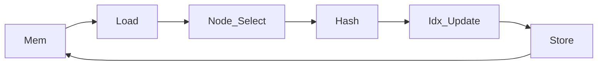
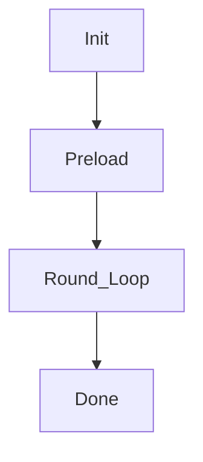
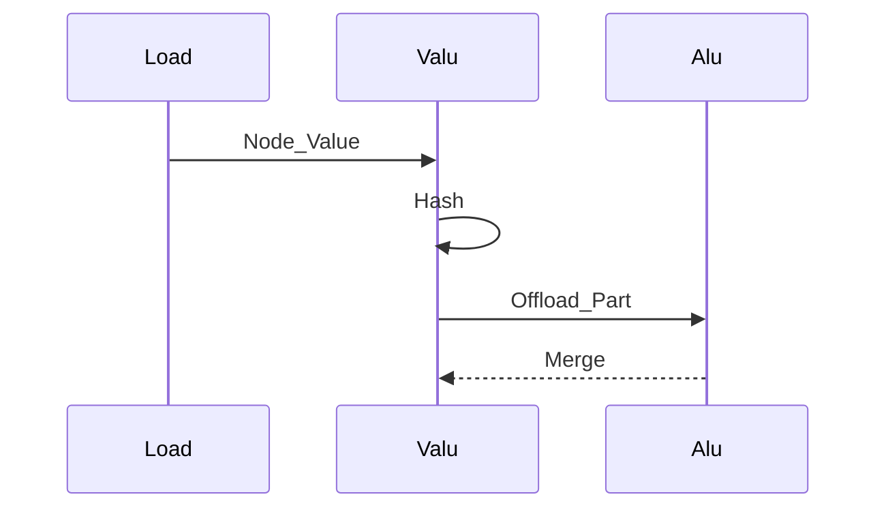
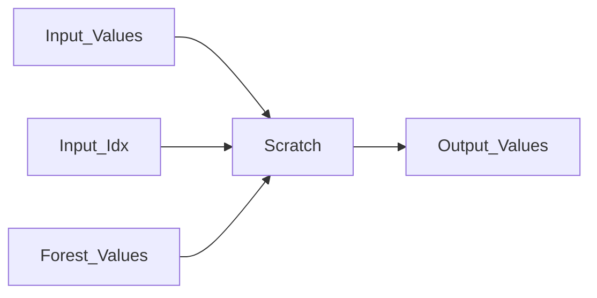
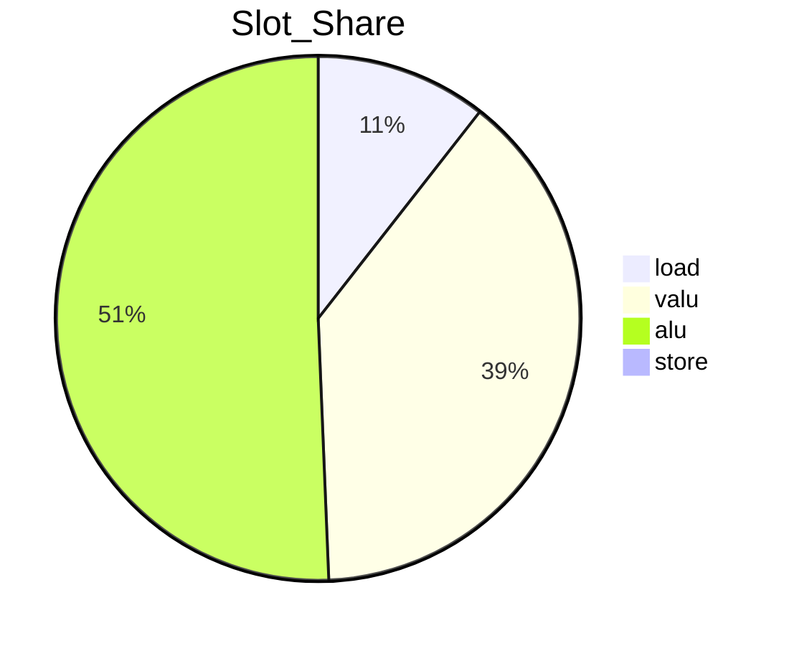
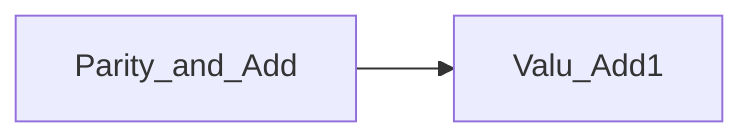
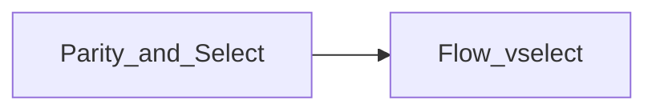
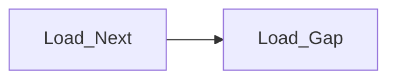
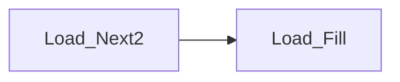
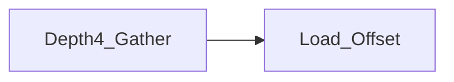

# 优化方案 v3.0（中文）

## 目标
- 目标：cycles ≤ 1200
- 当前基线：`tests/submission_tests.py` ≈ 1634 cycles（`rounds=16, batch=256`）
- 现状观测：`trace_any.py` 显示 VALU 仍为瓶颈，LOAD 与 ALU 有余量；flow 仅用于 idx 更新，load 空洞仍存在

## 第一性原理与资源约束
- 引擎并行度：`load=2, valu=6, alu=12, store=2, flow=1`
- 向量宽度：`VLEN=8`
- Scratch 上限：`SCRATCH_SIZE=1536`
- Memory 访问限制：无 vector gather，只有标量 `load_offset`
- 关键结论：仅靠调度无法达成 1200，需降低 `valu` 总量并填补 `load` 空洞

## 理论下界与数学推导
基于 trace 统计：
- `L ≈ 2187`
- `V ≈ 8024`
- `S = 32`
下界：
```
cycles >= max(ceil(L/2), ceil(V/6), ceil(S/2))
        = max(1094, 1338, 16)
        = 1338
```
要达到 1200，需要进一步降低 `V` 至 `<= 7200`，并减少 load 空洞带来的调度损耗。

## 核心瓶颈
- `valu` 过高（hash 链路与深度选择）
- `load` 仍有空洞（gather 预取深度不足）
- `vload/vstore/flow` 低利用率，难以填洞

## 本次优化要解决的问题
1) 补齐 `load` 空洞，减少等待
2) 降低 `valu` 数量与峰值
3) 通过调度器 3.0 抬升平均 slot 利用率
4) 保证正确性与 scratch 不超限

## 系统架构图


## 流程图


## 时序图


## 数据流程图


## 饼图


---

# 优化项 0：Flow vselect 索引更新（已落地）
- **优先级**：★★★★☆
- **核心思想**：将 idx 更新中的 `+1` VALU 操作替换为 `flow vselect`，直接生成 `(val & 1) ? 2 : 1`，降低 VALU 压力并提升 flow 利用率。
- **步骤**：
  1. 计算 `parity = val & 1`。
  2. 使用 `vselect(parity, two_v, one_v)` 生成 offset。
  3. 通用分支仍用 `idx = idx * 2 + offset`。
- **改进前后图表**：


- **代码草案**：
```python
# parity = val & 1
# offset = vselect(parity, two_v, one_v)
# idx = idx * 2 + offset
```
- **校验**：
  - `python tests/submission_tests.py`
  - `python trace_any.py trace/trace.json --top 20`
- **风险与缓解**：
  - 风险：flow 过载导致瓶颈
  - 缓解：仅替换 idx 更新分支，避免在深度选择中泛化使用

---

# 优化项 1：三缓冲 gather 预取扩展
- **优先级**：★★★★★
- **核心思想**：将 gather 预取从 next_group 扩展到 next2_group，使用三缓冲 `node_v`，提高 load 端饱和度。
- **步骤**：
  1. 新增第三个 node buffer（`node_v2_base`），形成三缓冲轮转。
  2. 在当前 group 哈希期间，提前计算 next2_group 的 addr，并分批 `load_offset`。
  3. 调整 `load_per_point` 为 3 或动态值，填补 load 空洞。
- **改进前后图表**：


- **代码草案**：
```python
# new buffer: node_v2_base
# rotate buffers per group: cur, next, next2
# precompute addr for next2_group and issue load_offset earlier
```
- **校验**：
  - `python tests/submission_tests.py`
  - `trace_any.py` 查看 load 空洞减少
- **风险与缓解**：
  - 风险：scratch 超限
  - 缓解：降低 pipe 或复用临时缓冲区

---

# 优化项 2：hash 分阶段 ALU 旁路加强
- **优先级**：★★★★☆
- **核心思想**：针对 hash 中 `^` 和 `>>` 这种高频操作，提升 ALU 旁路比例以降低 VALU 峰值。
- **步骤**：
  1. 对 hash 的 op1/op2/op3 根据 stage 做不同旁路比例。
  2. 针对 `^` 操作提高旁路，减少 VALU 峰值。
  3. 确保旁路仅在 slot 充足时启用，避免 ALU 拥塞。
- **改进前后图表**：


- **代码草案**：
```python
# stage-aware offload:
# if stage in {1,3,5}: offload ratio = 1/4
# else: ratio = 1/6
```
- **校验**：
  - `trace_any.py` 观察 VALU 利用率下降
  - correctness tests
- **风险与缓解**：
  - 风险：ALU 侧变为瓶颈
  - 缓解：动态调节比例，按 stage 固定阈值

---

# 优化项 3：Depth4 低 VALU mux
- **优先级**：★★★★☆
- **核心思想**：预载 depth4 节点，构造更浅的选择树，降低 `load_offset` 与 VALU 数。
- **步骤**：
  1. 预载 15..30 节点到 scratch。
  2. 使用分层 delta 选择，减少 multiply_add 次数。
  3. 在 scratch 限制内复用中间量。
- **改进前后图表**：


- **代码草案**：
```python
# build delta pairs, then 2-level mux
# reduce number of multiply_add ops
```
- **校验**：
  - `rounds=5` 快速对比
  - trace 查看 load_offset 减少
- **风险与缓解**：
  - 风险：scratch 增长
  - 缓解：共享 depth2 中间缓冲区

---

# 优化项 4：调度器 3.0 引擎队列与轻量回溯
- **优先级**：★★★☆☆
- **核心思想**：引入按引擎队列的 ready 结构，并在关键周期允许轻量回溯填洞。
- **步骤**：
  1. 为 load/valu/alu 各自维护 ready 队列。
  2. 每周期先填满 load 与 valu，再回溯调整。
  3. 统计 engine 空洞并迭代调参。
- **改进前后图表**：


- **代码草案**：
```python
# ready_valu, ready_load, ready_alu
# fill in order, then backtrack swap if beneficial
```
- **校验**：
  - `trace_any.py` 统计空洞减少
  - correctness tests
- **风险与缓解**：
  - 风险：调度复杂度上升
  - 缓解：保留旧调度器开关
